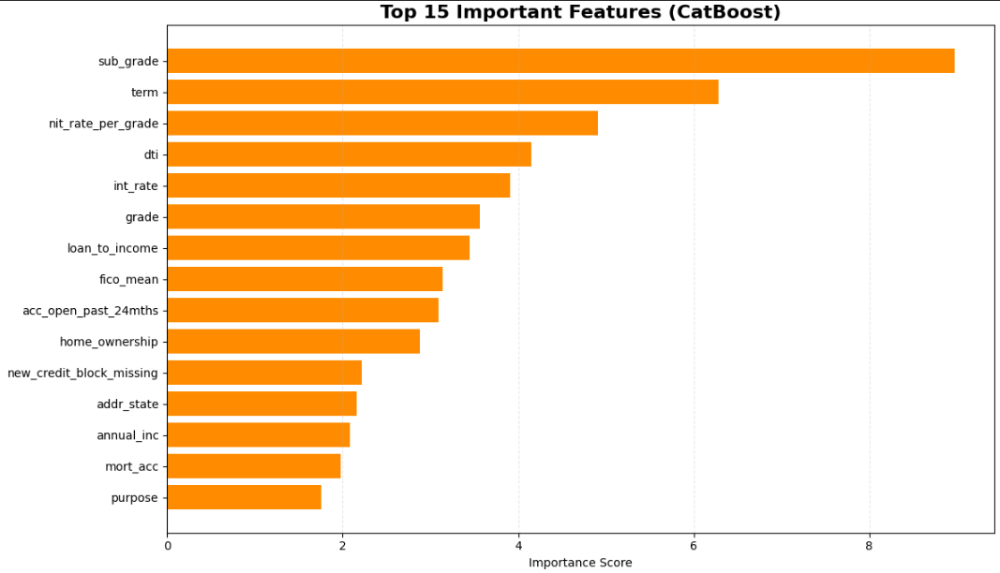
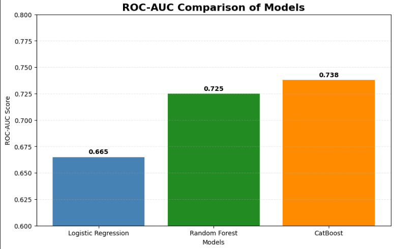
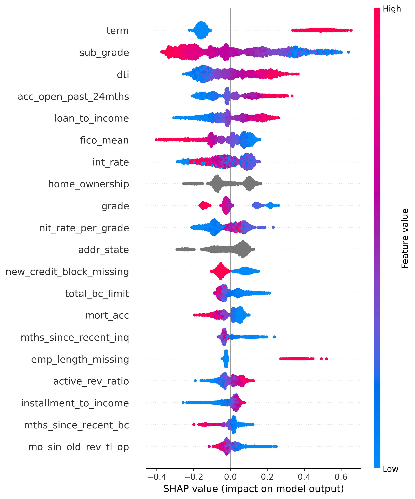

# 🏦 Credit Risk Prediction using Lending Club Loan Data

## 📌 Project Overview

This project develops an machine learning pipeline to predict loan default risk using historical Lending Club loan data. The objective is to identify high-risk borrowers and support data-driven lending decisions.

The project includes data cleaning, exploratory data analysis, feature engineering, model development, explainability, and business impact assessment.

---

## 🎯 Business Problem

Loan defaults can result in significant financial losses for lenders. Traditional credit evaluation methods may fail to capture complex borrower behavior patterns.

This project aims to:

- Predict loan default probability
- Identify key drivers of borrower risk
- Improve credit risk assessment
- Support lending and underwriting decisions

---

## 📊 Dataset

**Source:** Lending Club Historical Loan Data

### Dataset Characteristics

- 1.3+ Million Loan Records
- 90+ Features
- Binary Classification Problem

### Target Variable

| Value | Meaning |
|---------|---------|
| 0 | Fully Paid |
| 1 | Default / Charged Off |

---

## 🧹 Data Preparation

### Data Cleaning

- Missing value treatment
- Rare category handling
- Removal of low-information features
- Creation of missing-value indicators
- Feature selection

### Feature Engineering

Several domain-specific features were engineered:

- Loan-to-Income Ratio
- Installment-to-Income Ratio
- Active Revolving Account Ratio
- Revolving Balance Ratio
- Interest Rate per Grade
- Credit History Length
- Delinquency Buckets
- Inquiry Buckets
- Bankruptcy Buckets

---

## 🔍 Exploratory Data Analysis

### Key Findings

- Lower credit grades exhibited higher default rates.
- Higher debt-to-income ratios increased risk.
- Recent credit inquiries were associated with higher default probability.
- Longer loan terms demonstrated higher default rates.
- Previous delinquencies and bankruptcies were strong risk indicators.

---

## 🤖 Machine Learning Models

Three models were evaluated:

### 1️⃣ Logistic Regression

Baseline interpretable model.

**ROC-AUC:** 0.665

---

### 2️⃣ Random Forest

Tree-based ensemble model.

**ROC-AUC:** 0.725

---

### 3️⃣ CatBoost

Gradient boosting model optimized for tabular data.

**ROC-AUC:** 0.738

---

## 🏆 Model Performance Comparison

The CatBoost model achieved the highest ROC-AUC score (0.738), outperforming Logistic Regression and Random Forest.

---

## 🔥 Feature Importance Analysis

The most influential predictors of default risk were:

- Loan Term
- Sub Grade
- Debt-to-Income Ratio
- Grade
- Interest Rate
- FICO Score

---

## 🧠 SHAP Explainability

SHAP analysis revealed that longer loan terms, higher debt burden, poorer credit grades, and lower FICO scores significantly increase default risk.

## 🧠 Explainable AI with SHAP

SHAP (SHapley Additive exPlanations) was used to interpret model predictions and validate model behavior.

### Features Increasing Default Risk

🔺 Longer Loan Terms

🔺 Higher Debt-to-Income Ratios

🔺 Lower Credit Grades

🔺 Higher Loan-to-Income Ratios

🔺 Lower FICO Scores

### Features Reducing Default Risk

🟢 Better Credit Grades

🟢 Higher FICO Scores

🟢 Lower Debt Burden

🟢 Strong Credit History

---

## 💼 Business Impact

The developed model can help financial institutions:

- Identify high-risk borrowers
- Reduce loan default losses
- Improve lending decisions
- Support risk-based pricing
- Enhance portfolio risk management

---

## 🛠️ Tech Stack

### Programming & Analysis

- Python
- Pandas
- NumPy

### Visualization

- Matplotlib
- Seaborn

### Machine Learning

- Scikit-Learn
- CatBoost

### Explainability

- SHAP

---

## 📈 Results Summary

| Metric | Final CatBoost Model |
|----------|----------:|
| Accuracy | 0.664 |
| Precision | 0.334 |
| Recall | 0.688 |
| F1 Score | 0.450 |
| ROC-AUC | 0.738 |

---

## 🎯 Conclusion

An end-to-end credit risk prediction system was successfully developed using Lending Club loan data.

Among the evaluated models, CatBoost delivered the strongest performance with a ROC-AUC score of **0.738** while maintaining strong recall for identifying risky borrowers.

Feature importance analysis and SHAP explainability confirmed that loan term, credit quality, debt burden, and borrower credit behavior are the primary drivers of loan default risk.

This project demonstrates how machine learning and explainable AI can support more effective lending decisions and credit risk management strategies.

---

## 🚀 Future Improvements

- Hyperparameter Optimization
- XGBoost / LightGBM Comparison
- Probability Calibration
- Deployment using Streamlit or FastAPI
- Real-Time Credit Risk Scoring API
